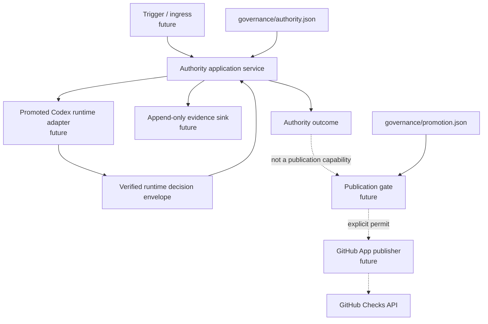
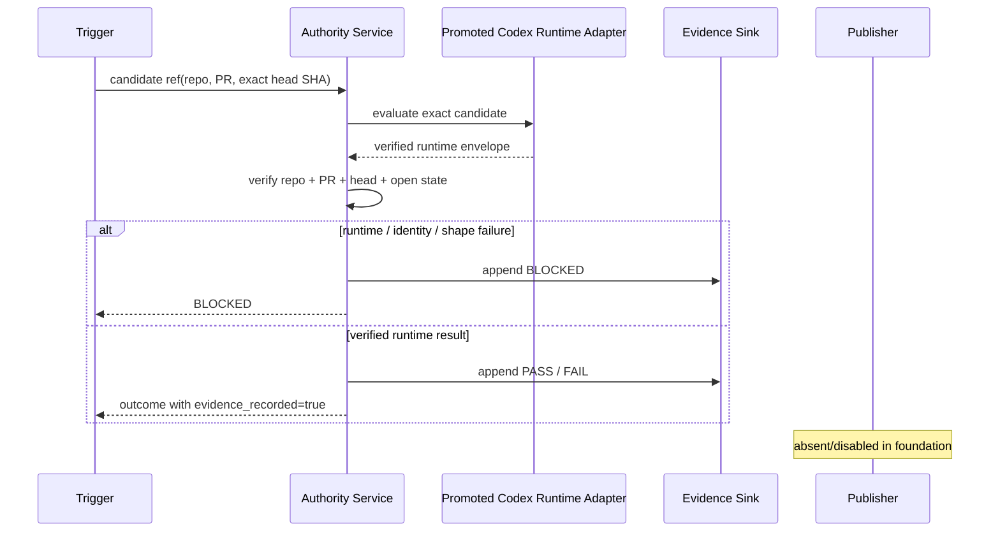
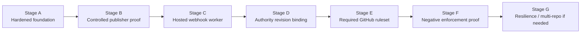

# Codex Authority Implementation Architecture

> **Scope:** This document is an implementation-local, non-normative view.
> Normative EAD/PAD/SAD/ADR artifacts for Codex and Codex Authority belong in
> `scnehaux/codex-architecture` and will be validated by Codex.

## Architectural intent

`scnehaux/codex-authority` is the independently administered runtime boundary
that will execute an explicitly promoted Codex runtime and, after a separate
publication authorization step, publish the `Codex Governance Authority` Check
through the dedicated GitHub App.

The architecture optimizes for a small trusted computing base, explicit source
identity, fail-closed behavior, and incremental evolution rather than premature
distributed-system complexity.

## Responsibility split

```text
scnehaux/codex
  framework + schemas + validators + governance runtime

scnehaux/codex-architecture
  normative architecture model for Codex + Codex Authority

scnehaux/codex-authority
  trusted runtime execution + evidence + publication + deployment
```

The authority repository must not grow a second implementation of Codex
governance semantics.

## Component model



The foundation slice implements the pure service boundary, trust-boundary model,
and ports. It intentionally has no network adapter, publisher, deployment
adapter, or credential-bearing code.

## Evaluation sequence



## Invariants

1. **Independent source:** authority source and deployment are outside the
   candidate repository.
2. **Codex owns governance semantics:** authority orchestration consumes a
   verified promoted Codex runtime envelope rather than rebuilding collectors or
   evaluators.
3. **Exact candidate binding:** repository, pull request, and head SHA are
   re-checked against the verified runtime envelope.
4. **No candidate execution:** candidate code never executes in the authority.
5. **Credential separation:** evaluation runtime remains credential-free;
   publisher credentials exist only in the future publisher boundary.
6. **Fail closed:** runtime, identity, shape, and evidence failures cannot become
   a passing authority result.
7. **Evidence before success:** a passing `AuthorityOutcome` cannot exist unless
   required evidence was recorded.
8. **No implicit publication:** an outcome is not a publication permit.
9. **Explicit source taxonomy:** Codex evaluator, Codex runtime, authority
   service, publisher, and deployment artifact identities remain distinct.
10. **No implicit promotion:** merging authority source does not make that commit
    effective.
11. **No implicit enforcement claim:** a published check does not prove GitHub
    actually blocks invalid merges.

## Source identity taxonomy

`governance/promotion.json` deliberately distinguishes:

- `codex_evaluator_source_revision`
- `codex_runtime_source_revision`
- `authority_service_source_revision`
- `publisher_source_revision`
- `deployment_artifact_digest`

These identities may later point at related revisions, but they are never
collapsed into an ambiguous generic `authority_revision`.

## Repository source protection

`governance/repository-protection.json` records the provider protection required
before the publisher becomes live. Until provider evidence exists, its
`provider_state.enforced` flag remains false.

The target provider state requires PR-only changes, the `Authority Foundation`
check, no force pushes, no branch deletion, linear history, and squash-only
merges.

## Evolution path



### Stage B — controlled publisher proof

Introduce a publication permit and GitHub App publisher behind a disabled-by-
default promotion gate. The publisher must accept only a tightly bound permit,
never a raw `AuthorityOutcome`.

Before a live App credential is used, provider-side protection of this
repository and a battle-tested secret-scanning control must be proven.

### Stage C — hosted worker

Add webhook ingress and deployment to a small independently administered
runtime. Start stateless. Add durable queue/idempotency storage only if delivery
semantics require it.

### Stage D — authority binding

Promote immutable reviewed source and deployment identities explicitly.
Candidate changes still cannot deploy or select them.

### Stage E/F — provider enforcement

Require both candidate qualification and external authority checks in GitHub.
Then run negative tests proving unauthorized merge/force/delete paths are
actually blocked before claiming effective enforcement.

### Stage G — scale only on evidence

Add multiple workers, queueing, richer audit storage, dashboarding, or multi-repo
support only when availability/load/operational evidence justifies them.
