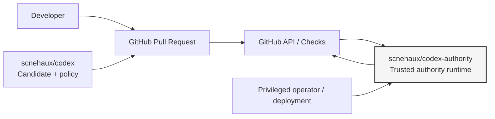
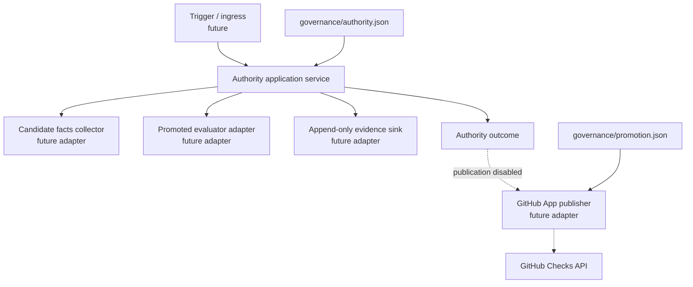
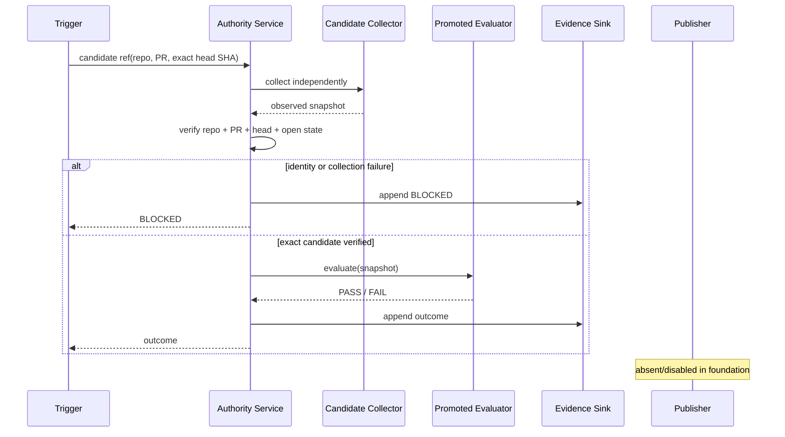
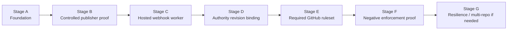

# Codex Authority Architecture

## Architectural intent

`scnehaux/codex-authority` is the independently administered runtime boundary
that evaluates `scnehaux/codex` pull requests and, after explicit promotion,
publishes the `Codex Governance Authority` Check through the dedicated GitHub
App.

The architecture optimizes for a small trusted computing base, explicit source
identity, fail-closed behavior, and incremental evolution rather than premature
distributed-system complexity.

## System context

The authority may observe candidate data, but the candidate may not select the
effective authority revision, inject authority credentials, or deploy itself
into the authority environment.

## Component model

The foundation slice implements only the pure application boundary and ports.
There is intentionally no network adapter and no publisher implementation yet.

## Evaluation sequence

## Invariants

1. **Independent source:** authority source and deployment are outside the candidate repository.
2. **Exact candidate binding:** repository, pull request, and head SHA are re-observed and must match the requested identity.
3. **No candidate execution:** the authority handles bounded data, not candidate code.
4. **Fail closed:** collection, identity, evaluator, and evidence failures cannot become a passing authority result.
5. **No implicit promotion:** merging authority source does not make that commit effective.
6. **No implicit publication:** implementing a publisher does not enable it.
7. **No implicit enforcement claim:** a published check does not prove GitHub actually blocks invalid merges.
8. **Credential isolation:** GitHub App credentials and webhook secrets live only in the runtime secret boundary.

## Evolution path

### Stage A — foundation

Pure domain/application core, trust and promotion contracts, no credentials,
no network adapter, no publication.

### Stage B — controlled publisher proof

Add a GitHub App publisher behind an explicit disabled-by-default promotion
gate. Prove that the configured App publishes the exact check context on the
exact candidate SHA. Record durable publisher evidence.

### Stage C — hosted worker

Add webhook ingress and deployment to a small independently administered
runtime. Start stateless. Add durable queue/idempotency storage only if delivery
semantics require it.

### Stage D — authority binding

Promote an immutable reviewed authority revision and bind the candidate control
plane to that revision. Candidate changes still cannot deploy or select it.

### Stage E/F — provider enforcement

Require both candidate qualification and external authority checks in GitHub.
Then run negative tests proving unauthorized merge/force/delete paths are
actually blocked before claiming effective enforcement.

### Stage G — scale only on evidence

Add multiple workers, queueing, richer audit storage, dashboarding, or multi-repo
support only when availability/load/operational evidence justifies them.

## Deployment shape

The initial production target should be a small VM/container or equivalent
single-purpose runtime. It need not remain a single instance forever. The
important invariant is that every active instance runs the same explicitly
promoted immutable authority revision and obtains credentials from an external
secret store.

## Failure semantics

Infrastructure uncertainty is `BLOCKED`, not `PASS`. A failure to fetch GitHub,
a stale/mismatched head SHA, evaluator exception, or inability to record required
evidence must never produce a successful authority publication.
